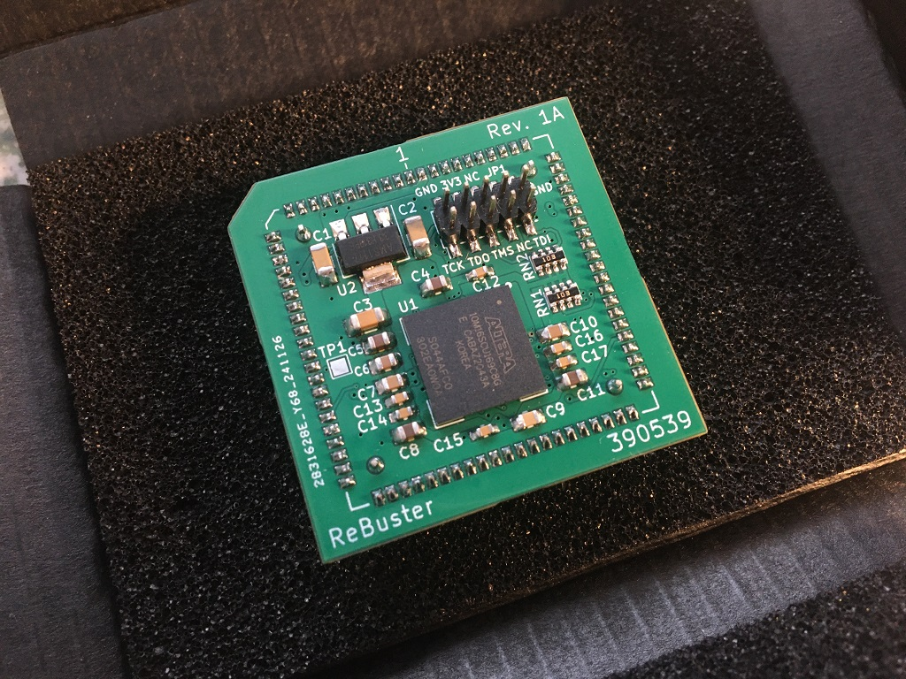
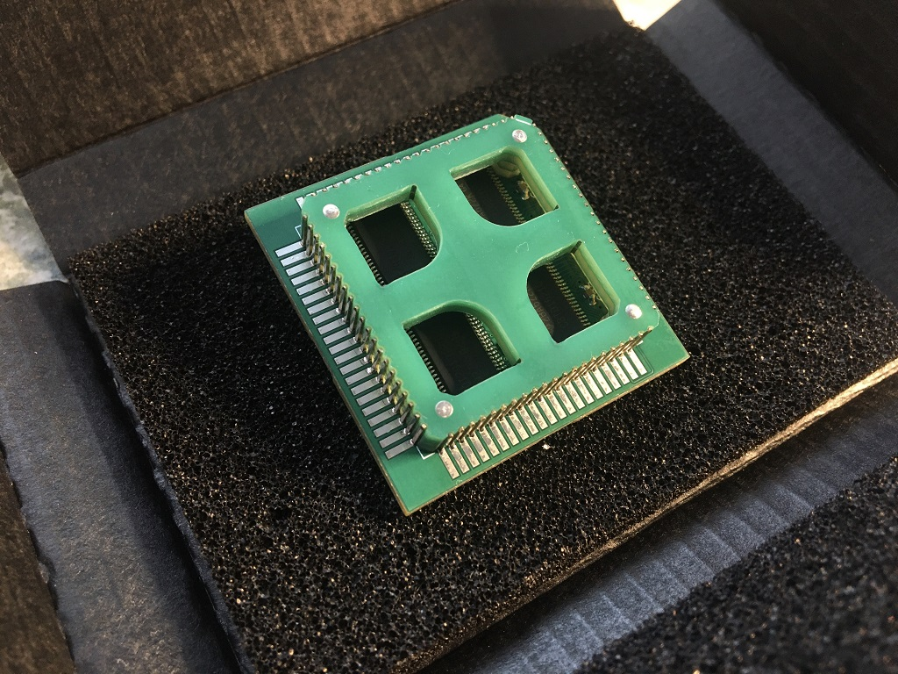
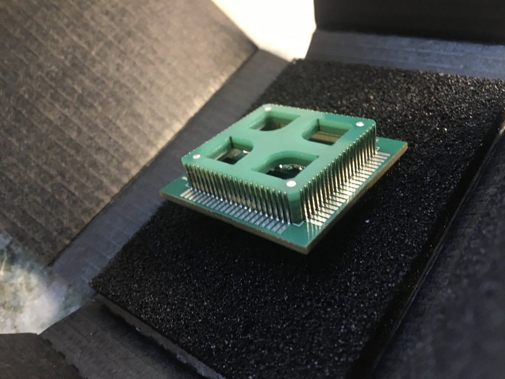
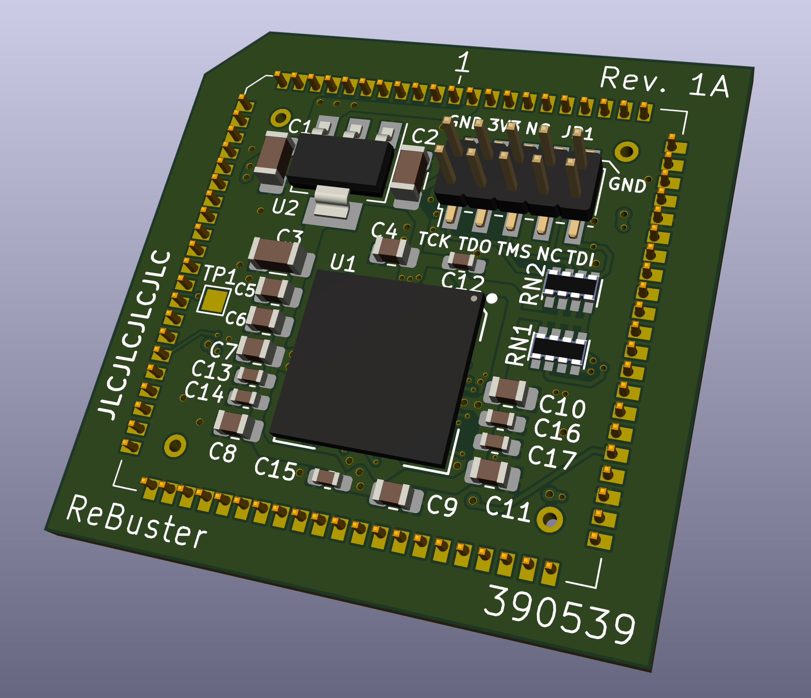
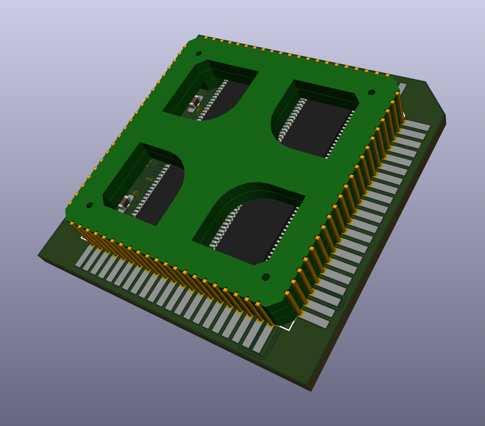
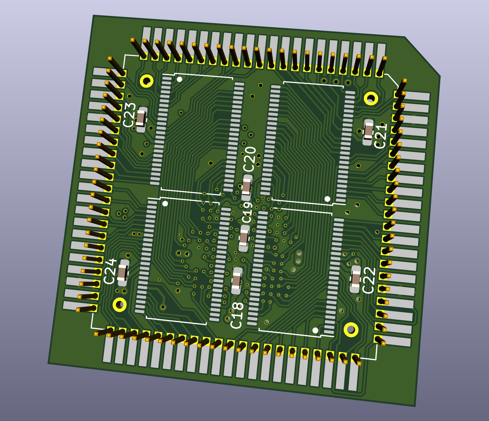
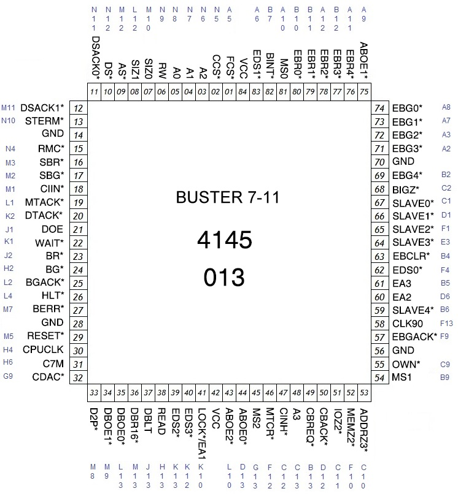

# ReBuster
A drop-in replacement PCB for the Amiga Super Buster chip

This is WORK IN PROGRESS. If you generate gerbers and order PCBs from this source you are doing so completely at your own risk!.

***

***

 

 

***

***

BOM Rev. 1A
---------
Reference  | Name/Value   | Package | Notes
-|-|-|-|
U1 | GW1N-UV9UG169C6/I5  | BGA-169 11.0x11.0mm_Layout13x13 | Gowin FPGA [GW1N-UV9UG169](https://www.mouser.com/ProductDetail/192-GW1NUV9UG169C6I5)
U2 | LM1117-3.3 | SOT-223 | Low-Dropout Linear Regulator 3.3 Volt
U3-U6 | SN74CBTD16210 | TSSOP-48 6.1x12.5mm_P0.5mm | 20-BIT FET Bus switch with level shifting, high-speed TTL-compatible. [74CBTD16210DGGR](https://www.mouser.com/ProductDetail/595-74CBTD16210DGGR)
U7 | Winslow PLCC-84 Plug | PLCC-84 Plug | Optionally use a home made plug (stacked PCBs)
U8 | PLCC-84_TH_pin_holes | TH_plug_pins | Pins that could be used with the DIY-plug PCBs rev1d for manual fitting, L8.7mm [Aliexpress](https://www.aliexpress.com/item/32893608810.html).
RN1, RN2 | CAY16A-4701F4LF RES ARRAY 4 Resistors 4.7k Ω | 1206 | [CAY16A-4701F4LF](https://eu.mouser.com/ProductDetail/652-CAY16A-4701F4LF)
C1-3 | Capacitor 10uF | 1206 | 
C4,C5,C8,C11 | Capacitor 1uF | 0805 | 
C6,C7,C9,C10 | Capacitor 0.1uF = 100nF | 0805 | 
C12-C19 | Capacitor 0.01uF = 10nF | 0603 |
C20 | Capacitor 0.1uF = 100nF | 0603 |
C21-C24 | Capacitor 0.01uF = 10nF | 0603 |
JTAG | SMT Pin Header Male | SMT 2 x 5 Pin 2.0mm pitch |

***

When ordering from JLCPCB select:

Specify Layer Sequence: Yes

    L1(Top layer):    F_Cu.gbr
    L2(Inner layer1): GND_Cu.gbr
    L3(Inner layer2): VCC_Cu.gbr
    L4(Bottom layer): B_Cu.gbr

Remove Order Number: 

    Specify a location

This will notify JLC where to put the order number, they will replace the "JLCJLCJLCJLC" silkscreen label.

***

[![CC BY-SA 4.0][cc-by-sa-shield]][cc-by-sa]

This work is licensed under a
[Creative Commons Attribution-ShareAlike 4.0 International License][cc-by-sa].

[![CC BY-SA 4.0][cc-by-sa-image]][cc-by-sa]

[cc-by-sa]: http://creativecommons.org/licenses/by-sa/4.0/
[cc-by-sa-image]: https://licensebuttons.net/l/by-sa/4.0/88x31.png
[cc-by-sa-shield]: https://img.shields.io/badge/License-CC%20BY--SA%204.0-lightgrey.svg
